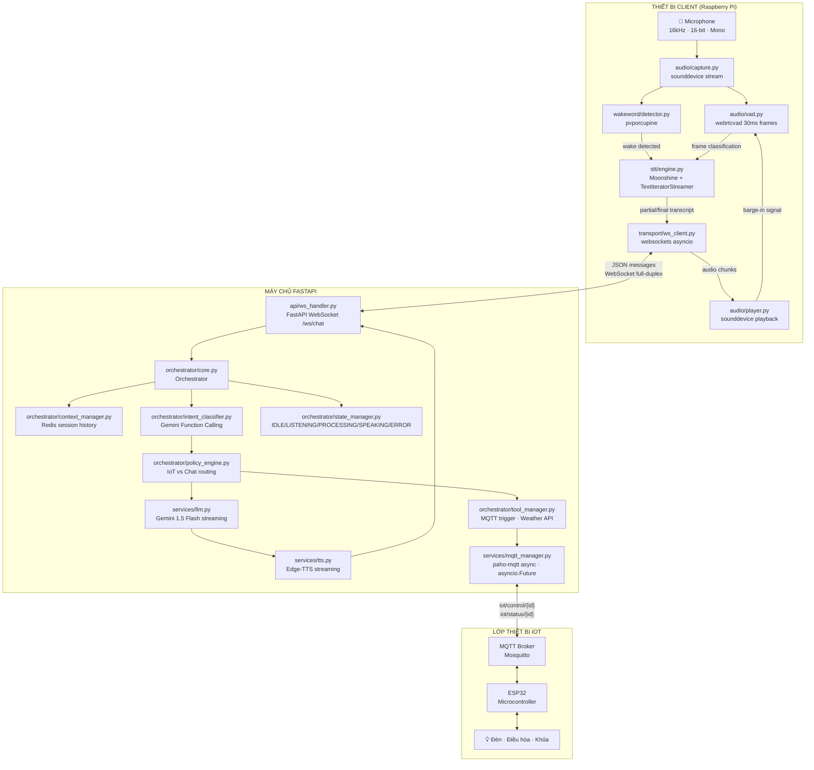
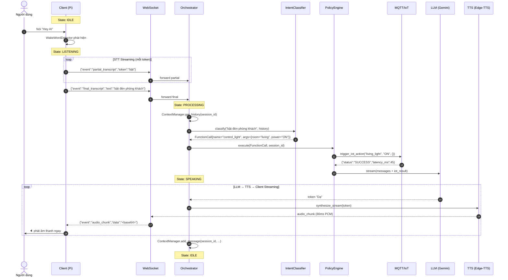
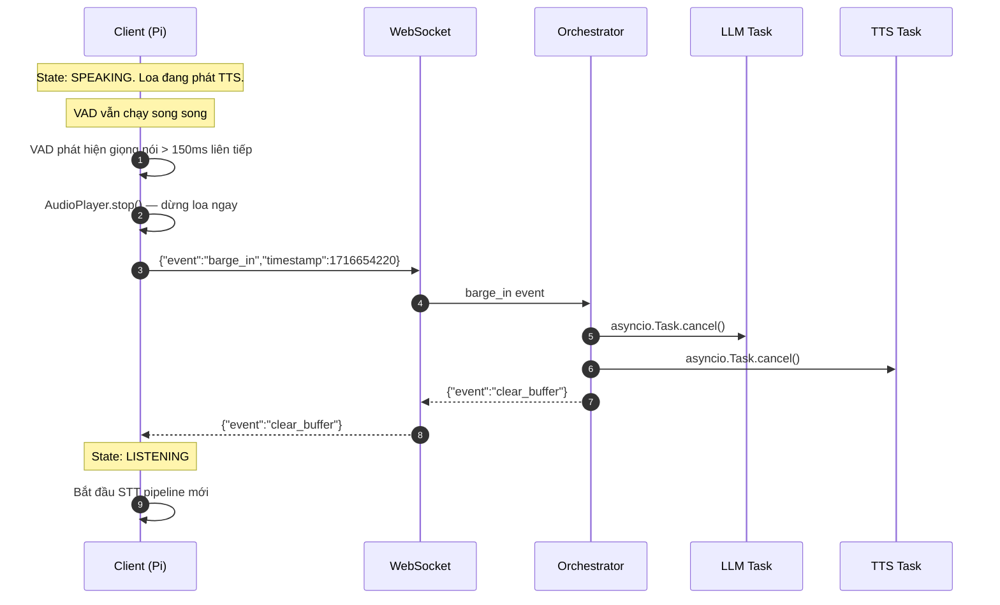
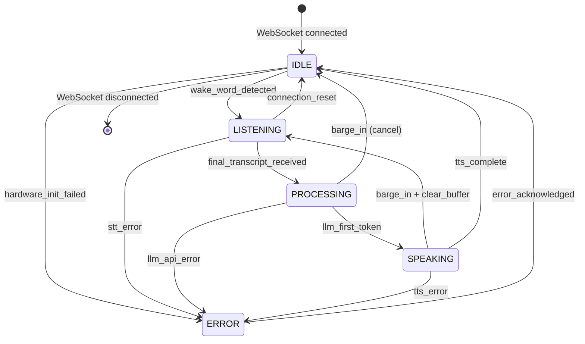

# Design Document: Voice Chatbot IoT

## Overview

Hệ thống Voice Chatbot IoT thời gian thực là nền tảng hội thoại bằng giọng nói tiếng Việt cho phép người dùng điều khiển thiết bị nhà thông minh qua ngôn ngữ tự nhiên. Kiến trúc gồm hai thành phần độc lập:

- **Client** (Raspberry Pi / Edge Device): xử lý âm thanh cục bộ, phát hiện wake word "Hey AI", chạy STT local với Moonshine, phát loa TTS.
- **Server** (FastAPI): điều phối AI trung tâm, chạy LLM streaming (Gemini 1.5 Flash), TTS streaming (Edge-TTS), điều khiển IoT qua MQTT.

Hai thành phần giao tiếp qua **WebSocket full-duplex** với mục tiêu độ trễ đầu cuối (E2E Latency) dưới **500ms**.

### Mục Tiêu Thiết Kế

- Độ trễ E2E < 500ms (STT ≤ 140ms + LLM first token ≤ 150ms + TTS first chunk ≤ 90ms + network ≤ 120ms)
- Word Error Rate (WER) < 10% cho tiếng Việt
- Barge-in success rate > 95%, dừng loa < 200ms
- IoT command success rate > 95%, device response < 100ms
- Không truyền audio lên server khi ở trạng thái IDLE (bảo vệ quyền riêng tư)

---

## Architecture

### Sơ Đồ Tổng Thể



### Cấu Trúc Thư Mục (Folder Structure)

```
zenta/
├── client/                          # Raspberry Pi / Edge Device
│   ├── audio/
│   │   ├── __init__.py
│   │   ├── capture.py               # sounddevice stream, 16kHz mono
│   │   ├── vad.py                   # webrtcvad wrapper, 30ms frames
│   │   └── player.py                # sounddevice playback, barge-in stop
│   ├── wakeword/
│   │   ├── __init__.py
│   │   └── detector.py              # pvporcupine wrapper
│   ├── stt/
│   │   ├── __init__.py
│   │   └── engine.py                # MoonshineForConditionalGeneration + TextIteratorStreamer
│   ├── transport/
│   │   ├── __init__.py
│   │   └── ws_client.py             # websockets asyncio, reconnect, send/recv
│   ├── config.py                    # SAMPLE_RATE, SERVER_URI, MODEL_ID, thresholds
│   ├── main.py                      # entry point, orchestrate pipeline
│   └── requirements.txt
│
├── server/                          # FastAPI Server
│   ├── api/
│   │   ├── __init__.py
│   │   └── ws_handler.py            # FastAPI WebSocket endpoint /ws/chat
│   ├── orchestrator/
│   │   ├── __init__.py
│   │   ├── core.py                  # Orchestrator class, main pipeline
│   │   ├── context_manager.py       # Redis session history
│   │   ├── intent_classifier.py     # Gemini Function Calling
│   │   ├── policy_engine.py         # business rules, IoT vs chat routing
│   │   ├── state_manager.py         # IDLE/LISTENING/PROCESSING/SPEAKING/ERROR
│   │   └── tool_manager.py          # MQTT trigger, weather API
│   ├── services/
│   │   ├── __init__.py
│   │   ├── llm.py                   # Gemini 1.5 Flash streaming
│   │   ├── tts.py                   # Edge-TTS streaming
│   │   └── mqtt_manager.py          # paho-mqtt async wrapper, asyncio.Future
│   ├── models/
│   │   ├── __init__.py
│   │   └── schemas.py               # Pydantic models for WS messages
│   ├── config.py                    # env vars, Redis URL, MQTT broker, API keys
│   ├── main.py                      # FastAPI app, uvicorn entry
│   └── requirements.txt
│
├── docs/                            # Tài liệu kiến trúc
├── .env.example                     # template env vars
└── README.md
```

---

## Components and Interfaces

### Client Components

#### `audio/capture.py` — Audio Capture Module

Mở sounddevice InputStream với thông số cố định: `sample_rate=16000`, `channels=1`, `dtype=int16`. Sử dụng callback non-blocking để đẩy frame vào `asyncio.Queue`. Mỗi frame có độ dài 480 samples (30ms × 16000Hz).

```python
class AudioCapture:
    SAMPLE_RATE: int = 16_000
    FRAME_DURATION_MS: int = 30          # 480 samples per frame
    CHANNELS: int = 1
    DTYPE: str = "int16"

    async def start(self) -> None: ...   # mở stream, bắt đầu callback
    async def stop(self) -> None: ...    # đóng stream
    def get_frame_queue(self) -> asyncio.Queue[bytes]: ...
```

#### `audio/vad.py` — Voice Activity Detection

Bọc `webrtcvad.Vad` với aggressiveness level 2 (cân bằng giữa sensitivity và false positive). Đếm frame silence liên tiếp; khi đạt 17 frame (≈500ms) → phát tín hiệu end-of-utterance. Khi `speaker_active=True` (loa đang phát), tự động tăng energy threshold để tránh barge-in nhầm.

```python
class VAD:
    SILENCE_THRESHOLD_FRAMES: int = 17  # 17 × 30ms = 510ms
    BARGE_IN_MIN_DURATION_MS: int = 150 # 5 frames liên tiếp

    def is_speech(self, frame: bytes, sample_rate: int = 16000) -> bool: ...
    def check_end_of_utterance(self, frame: bytes) -> bool: ...
    def check_barge_in(self, frame: bytes, speaker_active: bool) -> bool: ...
    def set_speaker_active(self, active: bool) -> None: ...
```

#### `audio/player.py` — Audio Playback

Phát audio chunks nhận từ server qua `sounddevice.OutputStream`. Duy trì internal queue để phát liên tục. Khi nhận lệnh `stop()`, xóa queue ngay lập tức (barge-in).

```python
class AudioPlayer:
    async def play_chunk(self, chunk: bytes) -> None: ...  # enqueue chunk
    def stop(self) -> None: ...                            # clear queue, stop stream
    @property
    def is_playing(self) -> bool: ...
```

#### `wakeword/detector.py` — Wake Word Detection

Bọc `pvporcupine` với keyword "Hey AI". Chỉ chạy khi state là IDLE. Trả về `True` khi phát hiện wake word.

```python
class WakeWordDetector:
    def __init__(self, access_key: str, keyword_path: str): ...
    def process(self, pcm_frame: list[int]) -> bool: ...   # True = wake word detected
    def delete(self) -> None: ...                          # giải phóng tài nguyên
```

#### `stt/engine.py` — Local STT Engine

Tải `UsefulSensors/moonshine-tiny-vi` qua `MoonshineForConditionalGeneration`. Sử dụng `TextIteratorStreamer` để phát token ngay khi sinh ra mà không chờ hoàn thành câu. Chạy inference trong thread pool để không block event loop.

```python
class STTEngine:
    MODEL_ID: str = "UsefulSensors/moonshine-tiny-vi"

    async def transcribe_stream(
        self, audio_frames: list[bytes]
    ) -> AsyncIterator[str]: ...   # yields tokens as they are generated

    async def transcribe_final(
        self, audio_frames: list[bytes]
    ) -> str: ...                  # returns complete transcript
```

#### `transport/ws_client.py` — WebSocket Client

Duy trì kết nối WebSocket bền vững đến server. Tự động reconnect với exponential backoff (delay = min(2^n, 60) giây, tối đa 5 lần). Gửi/nhận JSON messages.

```python
class WSClient:
    MAX_RETRIES: int = 5

    async def connect(self) -> None: ...
    async def send(self, message: dict) -> None: ...
    async def recv(self) -> dict: ...
    async def close(self) -> None: ...
    async def _reconnect_with_backoff(self) -> None: ...
```

#### `client/main.py` — Entry Point & Pipeline Orchestration

Điều phối toàn bộ pipeline client theo state machine đơn giản:

```
IDLE → (wake word) → LISTENING → (VAD end) → send final_transcript → wait server response
     ↑                                                                        |
     └──────────────────── (clear_buffer received) ──────────────────────────┘
```

---

### Server Components

#### `api/ws_handler.py` — WebSocket Endpoint

FastAPI WebSocket endpoint tại `/ws/chat`. Gán `session_id = uuid4()` cho mỗi kết nối. Validate JSON schema bằng Pydantic. Dispatch events đến Orchestrator.

```python
@app.websocket("/ws/chat")
async def ws_chat(websocket: WebSocket): ...

class WSHandler:
    async def handle_message(self, session_id: str, raw: str) -> None: ...
    async def send_message(self, session_id: str, message: dict) -> None: ...
```

#### `orchestrator/core.py` — Orchestrator

Lớp trung tâm tích hợp 5 sub-module. Xử lý `final_transcript` theo pipeline: Context → Intent → Policy → LLM → TTS. Lưu tham chiếu `asyncio.Task` để hủy khi barge-in.

```python
class Orchestrator:
    def __init__(
        self,
        context_manager: ContextManager,
        intent_classifier: IntentClassifier,
        policy_engine: PolicyEngine,
        state_manager: StateManager,
        tool_manager: ToolManager,
    ): ...

    async def handle_final_transcript(
        self, session_id: str, text: str, websocket: WebSocket
    ) -> None: ...

    async def handle_barge_in(self, session_id: str) -> None: ...

    def _register_task(self, session_id: str, task: asyncio.Task) -> None: ...
    async def _cancel_task(self, session_id: str) -> None: ...
```

#### `orchestrator/context_manager.py` — Context Manager

Lưu lịch sử hội thoại trên Redis với sliding window 10 lượt. Key format: `session:{session_id}:history`.

```python
class ContextManager:
    HISTORY_KEY_TEMPLATE: str = "session:{session_id}:history"
    MAX_HISTORY: int = 10

    async def get_history(self, session_id: str) -> list[dict]: ...
    async def add_message(self, session_id: str, role: str, content: str) -> None: ...
    async def clear_session(self, session_id: str) -> None: ...
```

#### `orchestrator/intent_classifier.py` — Intent Classifier

Gửi transcript + function schemas đến Gemini API. Trả về `FunctionCall` hoặc `TextResponse`.

```python
@dataclass
class FunctionCall:
    name: str
    arguments: dict

@dataclass
class TextResponse:
    text: str

class IntentClassifier:
    IOT_FUNCTION_SCHEMAS: list[dict] = [...]  # Gemini function definitions

    async def classify(
        self, text: str, history: list[dict]
    ) -> FunctionCall | TextResponse: ...
```

#### `orchestrator/policy_engine.py` — Policy Engine

Định nghĩa business rules: nếu intent là `FunctionCall` → gọi `ToolManager`; nếu là `TextResponse` → gọi LLM trực tiếp.

```python
class PolicyEngine:
    async def execute(
        self,
        intent: FunctionCall | TextResponse,
        session_id: str,
        context: dict,
    ) -> PolicyResult: ...
```

#### `orchestrator/state_manager.py` — State Manager

Quản lý máy trạng thái với 5 trạng thái hợp lệ. Từ chối transition không hợp lệ.

```python
class State(str, Enum):
    IDLE = "IDLE"
    LISTENING = "LISTENING"
    PROCESSING = "PROCESSING"
    SPEAKING = "SPEAKING"
    ERROR = "ERROR"

VALID_TRANSITIONS: dict[State, set[State]] = {
    State.IDLE:       {State.LISTENING},
    State.LISTENING:  {State.PROCESSING, State.IDLE, State.ERROR},
    State.PROCESSING: {State.SPEAKING, State.IDLE, State.ERROR},
    State.SPEAKING:   {State.LISTENING, State.IDLE, State.ERROR},
    State.ERROR:      {State.IDLE},
}

class StateManager:
    async def transition(self, session_id: str, new_state: State) -> bool: ...
    def get_state(self, session_id: str) -> State: ...
```

#### `orchestrator/tool_manager.py` — Tool Manager

Thực thi các công cụ bên ngoài: MQTT IoT control, Weather API.

```python
class ToolManager:
    async def trigger_iot_action(
        self, device_id: str, action: str, parameters: dict
    ) -> IoTResult: ...

    async def query_weather(self, location: str) -> WeatherResult: ...
```

#### `services/llm.py` — LLM Service

Gọi Gemini 1.5 Flash API với streaming. Yield từng token ngay khi nhận được.

```python
class LLMService:
    MODEL: str = "gemini-1.5-flash"

    async def stream(
        self, messages: list[dict], system_prompt: str
    ) -> AsyncIterator[str]: ...   # yields tokens
```

#### `services/tts.py` — TTS Service

Gọi Edge-TTS với giọng tiếng Việt. Yield audio chunks (40–120ms mỗi chunk).

```python
class TTSService:
    VOICE: str = "vi-VN-HoaiMyNeural"
    CHUNK_SIZE_MS: int = 80  # target chunk duration

    async def synthesize_stream(
        self, text_stream: AsyncIterator[str]
    ) -> AsyncIterator[bytes]: ...  # yields PCM audio chunks
```

#### `services/mqtt_manager.py` — MQTT Manager

Bọc `paho-mqtt` với `asyncio.Future` để chuyển publish/subscribe thành awaitable. Timeout 100ms.

```python
class MQTTManager:
    COMMAND_TIMEOUT_S: float = 0.1  # 100ms

    async def send_command(
        self, device_id: str, parameters: dict
    ) -> dict: ...  # returns {"status": "SUCCESS"|"TIMEOUT", ...}
```

---

## Luồng Dữ Liệu (Data Flow)

### Sequence Diagram: Luồng Hội Thoại Đầy Đủ



### Sequence Diagram: Barge-In Flow



---

## Giao Thức WebSocket (WebSocket Protocol)

### Client → Server Messages

| Event                | Payload                                          | Mô tả                         |
| -------------------- | ------------------------------------------------ | ----------------------------- |
| `partial_transcript` | `{"event":"partial_transcript","token":"<str>"}` | Token STT tạm thời            |
| `final_transcript`   | `{"event":"final_transcript","text":"<str>"}`    | Transcript đầy đủ sau VAD end |
| `barge_in`           | `{"event":"barge_in","timestamp":<int>}`         | Người dùng nói chen ngang     |
| `stt_error`          | `{"event":"stt_error","message":"<str>"}`        | Lỗi STT engine                |

### Server → Client Messages

| Event          | Payload                                                 | Mô tả                     |
| -------------- | ------------------------------------------------------- | ------------------------- |
| `audio_chunk`  | `{"event":"audio_chunk","data":"<base64>","seq":<int>}` | Chunk âm thanh TTS        |
| `clear_buffer` | `{"event":"clear_buffer"}`                              | Xác nhận hủy sau barge-in |
| `session_init` | `{"event":"session_init","session_id":"<uuid>"}`        | Gán session ID            |
| `state_change` | `{"event":"state_change","state":"<State>"}`            | Thông báo đổi trạng thái  |
| `error`        | `{"event":"error","code":"<str>","message":"<str>"}`    | Lỗi server                |

### Error Codes

| Code                       | Mô tả                                   |
| -------------------------- | --------------------------------------- |
| `INVALID_PAYLOAD`          | JSON không hợp lệ hoặc sai schema       |
| `INVALID_STATE_TRANSITION` | Yêu cầu chuyển trạng thái không hợp lệ  |
| `LLM_ERROR`                | Lỗi Gemini API                          |
| `TTS_ERROR`                | Lỗi Edge-TTS                            |
| `IOT_TIMEOUT`              | Thiết bị IoT không phản hồi trong 100ms |
| `STT_ERROR`                | Lỗi STT engine phía client              |

---

## Máy Trạng Thái (State Machine)

### Sơ Đồ Trạng Thái



### Bảng Chuyển Trạng Thái Hợp Lệ

| Từ \ Đến       | IDLE | LISTENING | PROCESSING | SPEAKING | ERROR |
| -------------- | :--: | :-------: | :--------: | :------: | :---: |
| **IDLE**       |  —   |    ✅     |     ❌     |    ❌    |  ✅   |
| **LISTENING**  |  ✅  |     —     |     ✅     |    ❌    |  ✅   |
| **PROCESSING** |  ✅  |    ❌     |     —      |    ✅    |  ✅   |
| **SPEAKING**   |  ✅  |    ✅     |     ❌     |    —     |  ✅   |
| **ERROR**      |  ✅  |    ❌     |     ❌     |    ❌    |   —   |

Mọi transition không có dấu ✅ đều bị `StateManager` từ chối và ghi log cảnh báo.

---

## Các Thuật Toán Chính (Key Algorithms)

### VAD Segmentation Algorithm

```
Input: continuous audio stream (16kHz, 16-bit PCM)
Output: speech segments as byte arrays

1. Split stream into 30ms frames (480 samples each)
2. For each frame:
   a. Call webrtcvad.is_speech(frame, 16000)
   b. If speech: reset silence_counter, append to current_segment
   c. If silence: increment silence_counter
      - If silence_counter >= 17 (≈510ms) AND current_segment not empty:
        → emit current_segment as complete utterance
        → reset current_segment and silence_counter
3. Barge-in check (only when speaker_active=True):
   a. Track consecutive speech frames
   b. If consecutive_speech_frames >= 5 (≈150ms): emit barge_in event
```

### Moonshine Streaming STT

```
Input: audio segment (bytes)
Output: async stream of tokens

1. Convert bytes to float32 numpy array, normalize to [-1, 1]
2. Create TextIteratorStreamer(tokenizer, skip_special_tokens=True)
3. Launch model.generate() in ThreadPoolExecutor with streamer
4. Yield tokens from streamer as they arrive (non-blocking)
5. Collect all tokens → join → emit as final_transcript
```

### Barge-In Detection với Dynamic Threshold

```
Input: audio frame (bytes), speaker_active (bool)
Output: is_barge_in (bool)

1. Compute RMS energy of frame
2. If speaker_active:
   threshold = BASE_THRESHOLD * SPEAKER_ACTIVE_MULTIPLIER (e.g., 2.5×)
   Else:
   threshold = BASE_THRESHOLD
3. If energy > threshold: increment barge_in_frame_count
   Else: reset barge_in_frame_count = 0
4. Return barge_in_frame_count >= BARGE_IN_MIN_FRAMES (5 frames = 150ms)
```

### Exponential Backoff Reconnect

```
Input: attempt_number (1-5)
Output: delay_seconds

delay = min(2^attempt_number, MAX_DELAY=60)
# attempt 1: 2s, 2: 4s, 3: 8s, 4: 16s, 5: 32s
If attempt_number > MAX_RETRIES (5): raise ConnectionFailed
```

### LLM → TTS Pipeline (Token Buffering)

```
Input: async token stream from LLM
Output: async audio chunk stream to client

buffer = ""
For each token from LLM:
  buffer += token
  If buffer ends with sentence boundary (。.!?…) OR len(buffer) > 50 chars:
    Send buffer to TTS.synthesize_stream()
    For each audio_chunk from TTS:
      Send audio_chunk to WebSocket immediately
    buffer = ""
If buffer not empty: flush remaining buffer to TTS
```

---

## Data Models

### Pydantic Schemas

File: `server/models/schemas.py`

```python
from pydantic import BaseModel, Field
from enum import Enum
from typing import Literal, Union
import time


# ─── Enums ────────────────────────────────────────────────────────────────────

class SessionState(str, Enum):
    IDLE = "IDLE"
    LISTENING = "LISTENING"
    PROCESSING = "PROCESSING"
    SPEAKING = "SPEAKING"
    ERROR = "ERROR"


# ─── Client → Server Messages ─────────────────────────────────────────────────

class PartialTranscriptMsg(BaseModel):
    event: Literal["partial_transcript"]
    token: str

class FinalTranscriptMsg(BaseModel):
    event: Literal["final_transcript"]
    text: str

class BargeInMsg(BaseModel):
    event: Literal["barge_in"]
    timestamp: int = Field(default_factory=lambda: int(time.time()))

class STTErrorMsg(BaseModel):
    event: Literal["stt_error"]
    message: str

ClientMessage = Union[
    PartialTranscriptMsg,
    FinalTranscriptMsg,
    BargeInMsg,
    STTErrorMsg,
]


# ─── Server → Client Messages ─────────────────────────────────────────────────

class AudioChunkMsg(BaseModel):
    event: Literal["audio_chunk"]
    data: str          # base64-encoded PCM bytes
    seq: int           # sequence number for ordering

class ClearBufferMsg(BaseModel):
    event: Literal["clear_buffer"]

class SessionInitMsg(BaseModel):
    event: Literal["session_init"]
    session_id: str

class StateChangeMsg(BaseModel):
    event: Literal["state_change"]
    state: SessionState

class ErrorMsg(BaseModel):
    event: Literal["error"]
    code: str
    message: str

ServerMessage = Union[
    AudioChunkMsg,
    ClearBufferMsg,
    SessionInitMsg,
    StateChangeMsg,
    ErrorMsg,
]


# ─── MQTT Payloads ────────────────────────────────────────────────────────────

class IoTCommand(BaseModel):
    command_id: str
    action: Literal["WRITE", "READ"]
    parameters: dict
    sent_at: int = Field(default_factory=lambda: int(time.time()))

class IoTStatus(BaseModel):
    command_id: str
    status: Literal["SUCCESS", "FAILURE", "TIMEOUT"]
    current_state: dict = {}
    error_message: str = ""
    latency_ms: int = 0


# ─── Internal Models ──────────────────────────────────────────────────────────

class ConversationMessage(BaseModel):
    role: Literal["user", "assistant", "system"]
    content: str

class PolicyResult(BaseModel):
    iot_result: IoTStatus | None = None
    llm_context: list[ConversationMessage] = []
```

---

## Cấu Hình (Configuration)

### `client/config.py`

```python
import os

# Audio
SAMPLE_RATE: int = 16_000
FRAME_DURATION_MS: int = 30          # 480 samples
CHANNELS: int = 1
DTYPE: str = "int16"

# VAD
VAD_AGGRESSIVENESS: int = 2          # 0-3, higher = more aggressive
SILENCE_THRESHOLD_FRAMES: int = 17   # 17 × 30ms ≈ 510ms
BARGE_IN_MIN_FRAMES: int = 5         # 5 × 30ms = 150ms
SPEAKER_ACTIVE_MULTIPLIER: float = 2.5

# Wake Word
PORCUPINE_ACCESS_KEY: str = os.environ["PORCUPINE_ACCESS_KEY"]
PORCUPINE_KEYWORD_PATH: str = os.environ.get("PORCUPINE_KEYWORD_PATH", "hey_ai.ppn")

# STT
STT_MODEL_ID: str = "UsefulSensors/moonshine-tiny-vi"

# Transport
SERVER_URI: str = os.environ.get("SERVER_URI", "ws://localhost:8000/ws/chat")
WS_MAX_RETRIES: int = 5
```

### `server/config.py`

```python
import os

# Server
HOST: str = os.environ.get("HOST", "0.0.0.0")
PORT: int = int(os.environ.get("PORT", "8000"))

# Redis
REDIS_URL: str = os.environ.get("REDIS_URL", "redis://localhost:6379")
SESSION_HISTORY_MAX: int = 10

# LLM
GEMINI_API_KEY: str = os.environ["GEMINI_API_KEY"]
GEMINI_MODEL: str = "gemini-1.5-flash"

# TTS
TTS_VOICE: str = os.environ.get("TTS_VOICE", "vi-VN-HoaiMyNeural")
TTS_CHUNK_SIZE_MS: int = 80

# MQTT
MQTT_BROKER_HOST: str = os.environ.get("MQTT_BROKER_HOST", "localhost")
MQTT_BROKER_PORT: int = int(os.environ.get("MQTT_BROKER_PORT", "1883"))
MQTT_COMMAND_TIMEOUT_S: float = 0.1  # 100ms

# Logging
LOG_LEVEL: str = os.environ.get("LOG_LEVEL", "INFO")
```

### `.env.example`

```dotenv
# Client
PORCUPINE_ACCESS_KEY=your_picovoice_access_key
PORCUPINE_KEYWORD_PATH=./wakeword/hey_ai.ppn
SERVER_URI=ws://your-server-host:8000/ws/chat

# Server
GEMINI_API_KEY=your_gemini_api_key
REDIS_URL=redis://localhost:6379
MQTT_BROKER_HOST=localhost
MQTT_BROKER_PORT=1883
TTS_VOICE=vi-VN-HoaiMyNeural
HOST=0.0.0.0
PORT=8000
LOG_LEVEL=INFO
```

---

## Correctness Properties

_A property is a characteristic or behavior that should hold true across all valid executions of a system — essentially, a formal statement about what the system should do. Properties serve as the bridge between human-readable specifications and machine-verifiable correctness guarantees._

### Property 1: VAD Frame Length Invariant

_For any_ audio frame processed by the VAD module, the frame MUST contain exactly 480 samples (16000 Hz × 30ms) before being passed to `webrtcvad.is_speech()`. Frames of incorrect length SHALL be rejected.

**Validates: Requirements 1.2**

---

### Property 2: End-of-Utterance Trigger

_For any_ sequence of audio frames, the end-of-utterance signal SHALL be emitted if and only if there are at least 17 consecutive silence frames (≈510ms) following at least one speech frame. Fewer than 17 consecutive silence frames SHALL NOT trigger end-of-utterance.

**Validates: Requirements 1.3**

---

### Property 3: IDLE State Audio Privacy

_For any_ audio input received while the client is in IDLE state, the WebSocket client SHALL send zero messages to the server. No audio data, partial transcripts, or any other payload SHALL be transmitted during IDLE.

**Validates: Requirements 2.3**

---

### Property 4: Partial Transcript Message Schema

_For any_ token string generated by the STT engine, the WebSocket client SHALL send a message that (a) has `event == "partial_transcript"`, (b) has a `token` field containing exactly that token string, and (c) is valid JSON conforming to `PartialTranscriptMsg` schema.

**Validates: Requirements 3.3**

---

### Property 5: Reconnect Exponential Backoff

_For any_ reconnect attempt number `n` in range [1, 5], the delay before the next attempt SHALL equal `min(2^n, 60)` seconds. After the 5th failed attempt, no further reconnect SHALL be attempted and a `ConnectionFailed` exception SHALL be raised.

**Validates: Requirements 4.2**

---

### Property 6: Session ID Uniqueness

_For any_ set of concurrent WebSocket connections, all assigned `session_id` values SHALL be globally unique — no two active sessions SHALL share the same `session_id`.

**Validates: Requirements 4.3**

---

### Property 7: Invalid Payload Rejection with Connection Preservation

_For any_ message sent by the client that fails JSON parsing or Pydantic schema validation, the server SHALL respond with `{"event": "error", "code": "INVALID_PAYLOAD"}` AND the WebSocket connection SHALL remain open (not closed).

**Validates: Requirements 4.5**

---

### Property 8: Policy Engine Routing Invariant

_For any_ intent classified as a `FunctionCall`, the Policy Engine SHALL route execution to `ToolManager` and SHALL NOT call the LLM directly for that intent. _For any_ intent classified as a `TextResponse`, the Policy Engine SHALL route directly to the LLM and SHALL NOT invoke `ToolManager`.

**Validates: Requirements 5.4, 5.5**

---

### Property 9: Context Sliding Window

_For any_ session with more than 10 conversation turns, the history stored in Redis SHALL contain exactly the 10 most recent turns. Older turns SHALL be evicted. The order of the retained turns SHALL be preserved (most recent last).

**Validates: Requirements 5.6**

---

### Property 10: LLM Token Forwarding Without Buffering

_For any_ token emitted by the LLM streaming API, the Orchestrator SHALL forward that token to the TTS pipeline without waiting for subsequent tokens or a complete sentence (subject to the sentence-boundary buffering heuristic with max buffer size 50 chars).

**Validates: Requirements 6.3**

---

### Property 11: LLM Prompt Completeness

_For any_ combination of conversation history, IoT execution result, and final transcript, the prompt sent to the LLM SHALL contain all three components: (a) the conversation history from `ContextManager`, (b) the IoT result if a tool was invoked, and (c) the current `final_transcript`.

**Validates: Requirements 6.4**

---

### Property 12: TTS Audio Chunk Ordering

_For any_ sequence of audio chunks generated by the TTS service, the `Audio_Player` on the client SHALL play them in the exact order they were received (by `seq` number). No chunk SHALL be played out of order.

**Validates: Requirements 7.4**

---

### Property 13: Barge-In Threshold

_For any_ duration of continuous voice activity detected by VAD while the speaker is active, the barge-in event SHALL be triggered if and only if the duration is ≥ 150ms (≥ 5 consecutive speech frames at 30ms each). Durations shorter than 150ms SHALL NOT trigger barge-in.

**Validates: Requirements 8.2**

---

### Property 14: Dynamic VAD Threshold

_For any_ audio frame with a given RMS energy level `E`, the VAD speech detection threshold SHALL be strictly higher when `speaker_active=True` than when `speaker_active=False`. This ensures the same energy level `E` that would trigger speech detection in quiet mode does NOT trigger it when the speaker is playing audio.

**Validates: Requirements 8.8**

---

### Property 15: MQTT Command Message Completeness

_For any_ IoT command sent by `ToolManager`, the MQTT message published to `iot/control/{device_id}` SHALL contain all four required fields: `command_id` (non-empty string), `action` (valid action string), `parameters` (dict), and `sent_at` (Unix timestamp integer).

**Validates: Requirements 9.1**

---

### Property 16: MQTT Timeout Correctness

_For any_ IoT command, if the device response arrives within 100ms the result SHALL be `{"status": "SUCCESS", ...}`. If no response arrives within 100ms, the result SHALL be `{"status": "TIMEOUT", ...}`. There SHALL be no case where a response arriving after 100ms is treated as a success.

**Validates: Requirements 9.2, 9.3, 9.4**

---

### Property 17: Invalid State Transition Rejection

_For any_ state transition request where the (current_state, requested_state) pair is not in `VALID_TRANSITIONS`, the `StateManager` SHALL reject the transition (return `False`), leave the current state unchanged, and emit a warning log. The state SHALL never be set to an invalid value.

**Validates: Requirements 10.3**

---

## Error Handling

### Phân Loại Lỗi và Chiến Lược Xử Lý

| Lỗi                               | Nguồn                           | Hành động                             | State sau  |
| --------------------------------- | ------------------------------- | ------------------------------------- | ---------- |
| Microphone không khởi tạo được    | `audio/capture.py`              | Log ERROR, dừng pipeline              | ERROR      |
| Porcupine license invalid         | `wakeword/detector.py`          | Log CRITICAL, dừng pipeline           | ERROR      |
| STT inference error               | `stt/engine.py`                 | Gửi `stt_error` lên server, reset     | IDLE       |
| WebSocket disconnect              | `transport/ws_client.py`        | Exponential backoff reconnect (5 lần) | IDLE       |
| JSON schema invalid               | `api/ws_handler.py`             | Gửi `INVALID_PAYLOAD`, giữ kết nối    | không đổi  |
| Gemini API error/timeout          | `services/llm.py`               | Gửi `LLM_ERROR` đến client            | ERROR      |
| Edge-TTS error                    | `services/tts.py`               | Gửi `TTS_ERROR` đến client            | ERROR      |
| MQTT device timeout (100ms)       | `services/mqtt_manager.py`      | Trả `TIMEOUT`, chèn vào LLM prompt    | PROCESSING |
| Invalid state transition          | `orchestrator/state_manager.py` | Log WARNING, từ chối, giữ state       | không đổi  |
| asyncio.CancelledError (barge-in) | `orchestrator/core.py`          | Cleanup tasks, gửi `clear_buffer`     | LISTENING  |

### Error Recovery Flow

```
ERROR state
  → Log chi tiết (timestamp, session_id, error_type, stack_trace)
  → Gửi {"event":"error","code":"<code>","message":"<msg>"} đến client
  → Giải phóng tài nguyên (cancel tasks, close streams)
  → Chờ client acknowledge hoặc reconnect
  → Transition ERROR → IDLE
```

### Latency Budget Monitoring

Server ghi nhận timestamps tại các mốc xử lý để phát hiện bottleneck:

```python
# Trong Orchestrator.handle_final_transcript()
t0 = time.monotonic()  # nhận final_transcript
# ... STT processing ...
t1 = time.monotonic()  # gửi prompt đến LLM
# ... LLM first token ...
t2 = time.monotonic()  # nhận first token
# ... TTS first chunk ...
t3 = time.monotonic()  # gửi first audio chunk

logger.info(
    "latency",
    stt_ms=(t1-t0)*1000,
    llm_first_token_ms=(t2-t1)*1000,
    tts_first_chunk_ms=(t3-t2)*1000,
    total_ms=(t3-t0)*1000,
    session_id=session_id,
)
```

---

## Testing Strategy

### Phân Tầng Kiểm Thử

```
┌─────────────────────────────────────────────────────┐
│  E2E / Integration Tests (pytest + real services)   │
│  - Full pipeline latency measurement                │
│  - MQTT device simulation                           │
│  - WebSocket connection lifecycle                   │
├─────────────────────────────────────────────────────┤
│  Property-Based Tests (Hypothesis)                  │
│  - 17 correctness properties (100+ iterations each) │
│  - Pure logic: VAD, state machine, routing, schemas │
├─────────────────────────────────────────────────────┤
│  Unit Tests (pytest)                                │
│  - Specific examples and edge cases                 │
│  - Mock external services (Gemini, Edge-TTS, MQTT)  │
│  - Error handling paths                             │
└─────────────────────────────────────────────────────┘
```

### Property-Based Testing với Hypothesis

Thư viện: **`hypothesis`** (Python)

Mỗi correctness property được implement thành một test với `@given` decorator, chạy tối thiểu **100 iterations**.

```python
# Ví dụ: Property 2 — End-of-Utterance Trigger
from hypothesis import given, settings
from hypothesis import strategies as st

@given(
    speech_frames=st.integers(min_value=1, max_value=50),
    silence_frames=st.integers(min_value=0, max_value=30),
)
@settings(max_examples=200)
def test_end_of_utterance_trigger(speech_frames, silence_frames):
    """
    Feature: voice-chatbot-iot, Property 2: End-of-Utterance Trigger
    For any sequence of frames, end-of-utterance fires iff silence >= 17 consecutive frames.
    """
    vad = VAD()
    # Feed speech frames
    for _ in range(speech_frames):
        vad.process(make_speech_frame())
    # Feed silence frames
    triggered = False
    for _ in range(silence_frames):
        if vad.process(make_silence_frame()):
            triggered = True
            break

    expected = silence_frames >= 17
    assert triggered == expected
```

Tag format cho mỗi test: `# Feature: voice-chatbot-iot, Property {N}: {property_title}`

### Unit Tests — Edge Cases Quan Trọng

- Microphone không khởi tạo được → ERROR state
- Porcupine license invalid → pipeline dừng
- STT error mid-stream → gửi `stt_error`, reset về IDLE
- LLM API timeout → ERROR state + client notification
- TTS error → ERROR state
- WebSocket binary data → rejected
- Redis connection failure → graceful degradation (no history)

### Integration Tests

- Full pipeline latency: đo E2E từ `final_transcript` đến first audio chunk (target < 500ms)
- MQTT round-trip: publish command → receive status (target < 100ms)
- Barge-in end-to-end: detect → stop speaker → cancel tasks → clear_buffer (target < 200ms)
- WebSocket reconnect: simulate disconnect → verify reconnect with backoff
- Concurrent sessions: 10 simultaneous sessions, verify session isolation

### Smoke Tests

- `sounddevice` stream mở được với đúng thông số (16kHz, mono, int16)
- `pvporcupine` khởi tạo thành công với valid access key
- `StateManager` có đúng 5 trạng thái hợp lệ
- `Orchestrator` instance có đủ 5 sub-module attributes
- `MQTTManager` sử dụng `asyncio.Future` pattern
- Cấu trúc thư mục `client/` và `server/` tồn tại đúng theo spec
