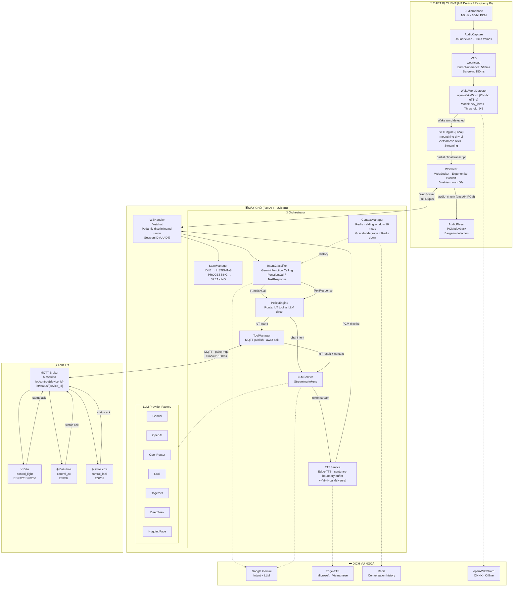
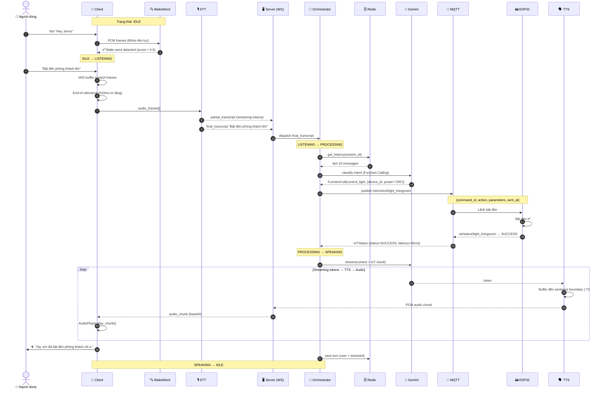
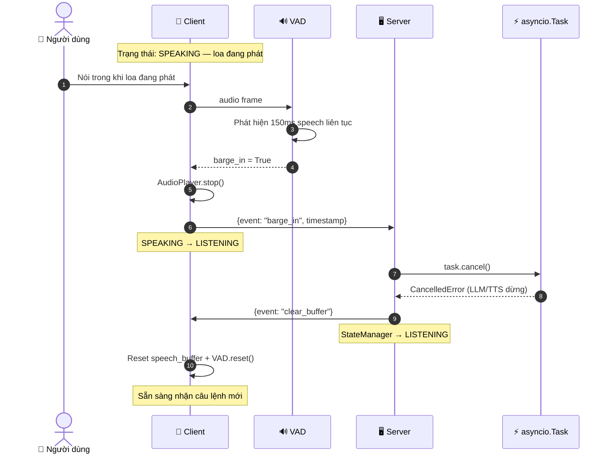
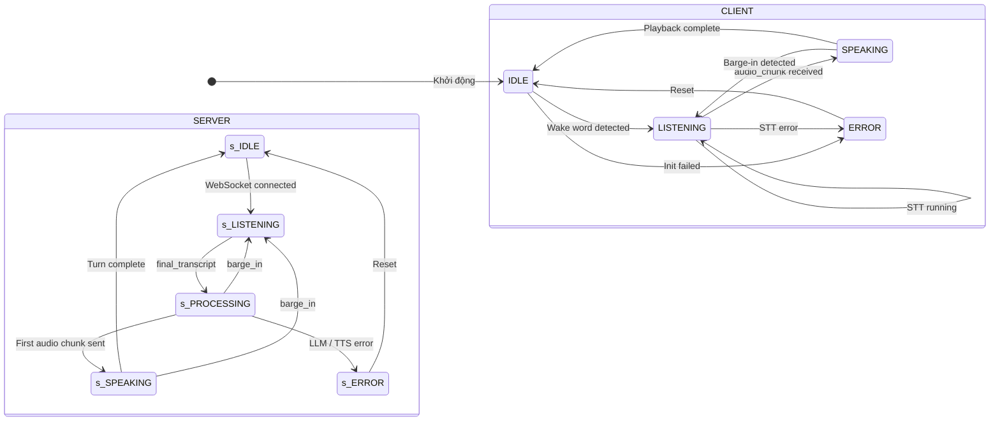
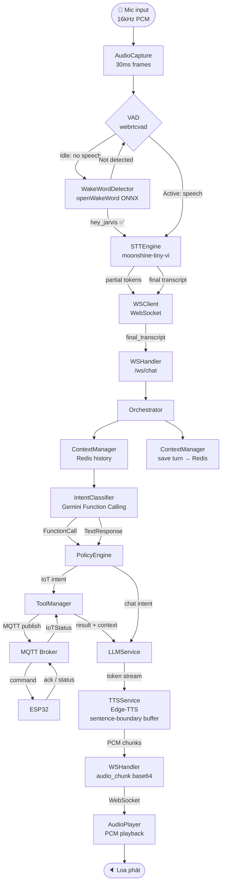

# Sơ Đồ Hoạt Động Hệ Thống

**Jarvis — Real-time Voice Chatbot IoT (Full-Duplex)**

---

## 1. Kiến Trúc Tổng Thể

---

## 2. Luồng Happy Path — Điều Khiển IoT

---

## 3. Luồng Barge-In — Ngắt Lời

---

## 4. State Machine

---

## 5. Luồng Dữ Liệu Chi Tiết

---

## 6. Tóm Tắt Thành Phần

| Thành phần | Công nghệ                       | Vai trò                                            |
| ---------- | ------------------------------- | -------------------------------------------------- |
| Wake Word  | openWakeWord (ONNX, offline)    | Phát hiện "hey_jarvis" không cần mạng              |
| STT        | moonshine-tiny-vi (HuggingFace) | Nhận dạng tiếng Việt local, streaming              |
| VAD        | webrtcvad                       | End-of-utterance 510ms · Barge-in 150ms            |
| Transport  | WebSocket (FastAPI + Uvicorn)   | Full-duplex, real-time, JSON + binary              |
| Intent     | Gemini Function Calling         | Phân loại IoT command vs chat                      |
| LLM        | Gemini (+ 6 providers)          | Sinh câu trả lời, streaming tokens                 |
| TTS        | Edge-TTS · vi-VN-HoaiMyNeural   | Giọng nói tiếng Việt, sentence-boundary buffer     |
| IoT Bus    | MQTT (Mosquitto + paho-mqtt)    | Điều khiển ESP32, request/response · timeout 100ms |
| Memory     | Redis                           | Lịch sử hội thoại, sliding window 10 turns         |
| Barge-in   | asyncio.Task cancel             | Ngắt lời real-time, không block pipeline           |

---

## 7. Thiết Bị IoT Được Hỗ Trợ

| Function              | Thiết bị                    | Tham số                                                                       |
| --------------------- | --------------------------- | ----------------------------------------------------------------------------- |
| `control_light`       | Đèn thông minh (ESP32)      | `device_id`, `power` ON/OFF, `brightness` 0–100, `color_temp` Kelvin          |
| `control_ac`          | Điều hòa (ESP32)            | `device_id`, `power` ON/OFF, `temperature` 16–30°C, `mode` COOL/HEAT/FAN/AUTO |
| `control_lock`        | Khóa cửa thông minh (ESP32) | `device_id`, `action` LOCK/UNLOCK                                             |
| `query_device_status` | Bất kỳ thiết bị             | `device_id`                                                                   |

---

## 8. LLM Provider Được Hỗ Trợ

| Provider               | Env Var              | Model mặc định                                   |
| ---------------------- | -------------------- | ------------------------------------------------ |
| **Gemini** _(default)_ | `GEMINI_API_KEY`     | `gemini-1.5-flash`                               |
| **OpenAI**             | `OPENAI_API_KEY`     | `gpt-4o-mini`                                    |
| **OpenRouter**         | `OPENROUTER_API_KEY` | `meta-llama/llama-3.1-8b-instruct:free`          |
| **Grok (xAI)**         | `XAI_API_KEY`        | `grok-3-mini`                                    |
| **Together AI**        | `TOGETHER_API_KEY`   | `meta-llama/Llama-3.2-11B-Vision-Instruct-Turbo` |
| **DeepSeek**           | `DEEPSEEK_API_KEY`   | `deepseek-chat`                                  |
| **HuggingFace**        | `HF_API_KEY`         | `meta-llama/Llama-3.1-8B-Instruct`               |

> Chọn provider qua biến môi trường: `LLM_PROVIDER=gemini`
