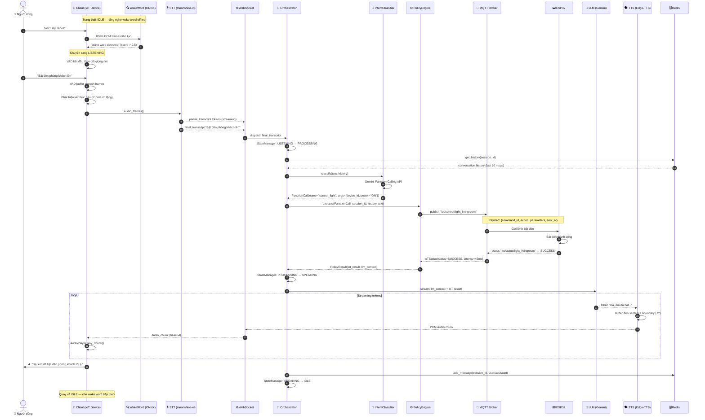
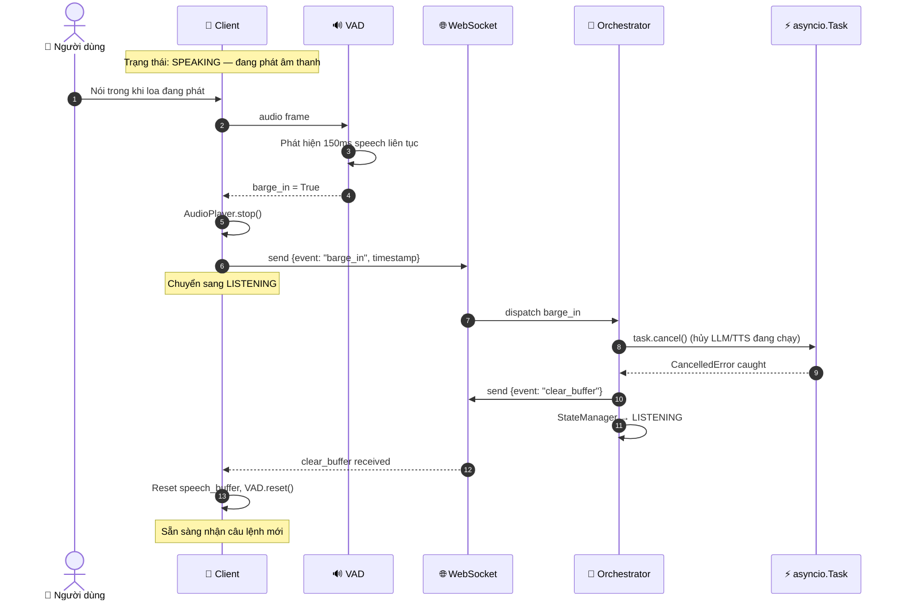

# SƠ ĐỒ HOẠT ĐỘNG HỆ THỐNG (ACTIVITY DIAGRAM)

## Jarvis — Voice Chatbot IoT (Real-time Full-Duplex)

---

## 1. Kiến Trúc Tổng Thể

```
╔══════════════════════════════════════════════════════════════════════════════════════════════╗
║                          JARVIS — VOICE CHATBOT IoT SYSTEM                                  ║
║                     Real-time Full-Duplex Voice Assistant (Vietnamese)                       ║
╚══════════════════════════════════════════════════════════════════════════════════════════════╝

┌─────────────────────────────────────────────────────────────────────────────────────────────┐
│                          THIẾT BỊ CLIENT (IoT Device / Raspberry Pi)                        │
│                                                                                             │
│  ┌──────────┐    ┌──────────────────┐    ┌──────────┐    ┌──────────────────────────────┐  │
│  │   🎤 Mic  │───▶│  AudioCapture    │───▶│   VAD    │    │     VoiceChatbotClient       │  │
│  │ 16kHz    │    │  sounddevice     │    │webrtcvad │    │     (State Machine)          │  │
│  │ 16-bit   │    │  30ms PCM frames │    │          │    │                              │  │
│  └──────────┘    └──────────────────┘    └────┬─────┘    │  ┌────────┐  ┌───────────┐  │  │
│                                               │          │  │  IDLE  │  │ LISTENING │  │  │
│                                               │          │  └────────┘  └───────────┘  │  │
│  ┌──────────────────────────────────────┐     │          │       ↕            ↕         │  │
│  │       WakeWordDetector               │◀────┘          │  ┌─────────┐  ┌──────────┐  │  │
│  │  openWakeWord (ONNX, offline)        │                │  │SPEAKING │  │  ERROR   │  │  │
│  │  Model: "hey_jarvis" (80ms frames)   │                │  └─────────┘  └──────────┘  │  │
│  │  Threshold: 0.5                      │                └──────────────────────────────┘  │
│  └──────────────────┬───────────────────┘                                                  │
│                     │ Wake Word Detected!                                                   │
│                     ▼                                                                       │
│  ┌──────────────────────────────────────┐                                                  │
│  │          STTEngine (Local)           │                                                  │
│  │  moonshine-tiny-vi (HuggingFace)     │                                                  │
│  │  Vietnamese ASR, TextIteratorStreamer│                                                  │
│  │  → partial_transcript tokens         │                                                  │
│  │  → final_transcript (full text)      │                                                  │
│  └──────────────────┬───────────────────┘                                                  │
│                     │                                                                       │
│  ┌──────────────────▼───────────────────┐    ┌──────────────────────────────────────────┐  │
│  │           WSClient                   │    │           AudioPlayer                    │  │
│  │  WebSocket + Exponential Backoff     │    │  Plays PCM chunks from server            │  │
│  │  (5 retries, max 60s)                │    │  VAD watches for barge-in (150ms speech) │  │
│  └──────────────────┬───────────────────┘    └──────────────────────────────────────────┘  │
│                     │                                          ▲                            │
└─────────────────────┼──────────────────────────────────────────┼────────────────────────────┘
                      │  WebSocket (ws://host:8000/ws/chat)       │
                      │  ← → Full-Duplex JSON + Binary            │
                      │                                           │
┌─────────────────────▼───────────────────────────────────────────┼────────────────────────────┐
│                          MÁY CHỦ (FastAPI Server — Uvicorn)      │                            │
│                                                                  │                            │
│  ┌───────────────────────────────────────────────────────────────┼──────────────────────────┐ │
│  │                    WSHandler  /ws/chat                        │                          │ │
│  │                                                               │                          │ │
│  │  1. accept() → assign session_id (UUID4)                      │                          │ │
│  │  2. send session_init {session_id}                            │                          │ │
│  │  3. Pydantic discriminated union validation                   │                          │ │
│  │                                                               │                          │ │
│  │  Events nhận từ Client:          Events gửi về Client:        │                          │ │
│  │  ┌─────────────────────┐         ┌──────────────────────┐    │                          │ │
│  │  │ partial_transcript  │         │ session_init         │    │                          │ │
│  │  │ final_transcript ───┼──┐      │ audio_chunk (base64) │────┘                          │ │
│  │  │ barge_in         ───┼──┤      │ clear_buffer         │                               │ │
│  │  │ stt_error           │  │      │ state_change         │                               │ │
│  │  └─────────────────────┘  │      │ error                │                               │ │
│  └───────────────────────────┼──────└──────────────────────┘───────────────────────────────┘ │
│                              │                                                               │
│                              ▼                                                               │
│  ┌────────────────────────────────────────────────────────────────────────────────────────┐  │
│  │                              ORCHESTRATOR (Core)                                       │  │
│  │                                                                                        │  │
│  │  Per session: asyncio.Task (cancellable on barge-in)                                   │  │
│  │                                                                                        │  │
│  │  ┌──────────────┐  ┌──────────────────┐  ┌──────────────────────────────────────────┐ │  │
│  │  │ StateManager │  │  ContextManager  │  │         Pipeline Flow                    │ │  │
│  │  │              │  │  Redis-backed    │  │                                          │ │  │
│  │  │ IDLE         │  │  Sliding window  │  │  final_transcript                        │ │  │
│  │  │   ↓          │  │  10 messages     │  │       │                                  │ │  │
│  │  │ LISTENING    │  │  Graceful degrade│  │       ▼                                  │ │  │
│  │  │   ↓          │  │  if Redis down   │  │  [1] Load history (Redis)                │ │  │
│  │  │ PROCESSING   │  └──────────────────┘  │       │                                  │ │  │
│  │  │   ↓          │                        │       ▼                                  │ │  │
│  │  │ SPEAKING     │                        │  [2] IntentClassifier                    │ │  │
│  │  │   ↓          │                        │      Gemini Function Calling API         │ │  │
│  │  │ IDLE         │                        │      ┌──────────────┬──────────────────┐ │ │  │
│  │  │              │                        │      │ FunctionCall │  TextResponse    │ │ │  │
│  │  │ (+ ERROR)    │                        │      │ (IoT intent) │  (chat intent)   │ │ │  │
│  │  └──────────────┘                        │      └──────┬───────┴────────┬─────────┘ │ │  │
│  │                                          │             │                │           │ │  │
│  │                                          │             ▼                ▼           │ │  │
│  │                                          │  [3] PolicyEngine                        │ │  │
│  │                                          │      ┌──────────────┐  ┌──────────────┐ │ │  │
│  │                                          │      │ ToolManager  │  │  LLM Direct  │ │ │  │
│  │                                          │      │ MQTT publish │  │  (no tool)   │ │ │  │
│  │                                          │      └──────┬───────┘  └──────┬───────┘ │ │  │
│  │                                          │             │ IoT result       │         │ │  │
│  │                                          │             └────────┬─────────┘         │ │  │
│  │                                          │                      ▼                   │ │  │
│  │                                          │  [4] LLMService (streaming tokens)       │ │  │
│  │                                          │      Provider: Gemini / OpenAI /         │ │  │
│  │                                          │      OpenRouter / Grok / Together /      │ │  │
│  │                                          │      DeepSeek / HuggingFace              │ │  │
│  │                                          │             │ token stream               │ │  │
│  │                                          │             ▼                            │ │  │
│  │                                          │  [5] TTSService (Edge-TTS)               │ │  │
│  │                                          │      Buffer tokens at sentence boundary  │ │  │
│  │                                          │      (.!?…) or 50 chars                  │ │  │
│  │                                          │      → synthesize → PCM chunks           │ │  │
│  │                                          │             │ audio chunks               │ │  │
│  │                                          │             ▼                            │ │  │
│  │                                          │  [6] WebSocket send audio_chunk (base64) │ │  │
│  │                                          │  [7] Save turn to Redis                  │ │  │
│  │                                          │  [8] StateManager → IDLE                 │ │  │
│  │                                          └──────────────────────────────────────────┘ │  │
│  └────────────────────────────────────────────────────────────────────────────────────────┘  │
│                                                                                               │
│  ┌──────────────────────────────────────────────────────────────────────────────────────────┐ │
│  │                         LLM Provider Factory (server/llms/)                              │ │
│  │  BaseLLMService ← GeminiLLMService | OpenAILLMService | OpenRouterLLMService             │ │
│  │                   GrokLLMService   | TogetherLLMService | DeepSeekLLMService             │ │
│  │                   HuggingFaceLLMService                                                  │ │
│  │  Chọn qua env: LLM_PROVIDER=gemini|openai|openrouter|grok|together|deepseek|huggingface  │ │
│  └──────────────────────────────────────────────────────────────────────────────────────────┘ │
└───────────────────────────────────────────────────────────────────────────────────────────────┘
                              │
                              │ MQTT (paho-mqtt)
                              │ Publish: iot/control/{device_id}
                              │ Subscribe: iot/status/{device_id}
                              │ Timeout: 100ms
                              ▼
┌─────────────────────────────────────────────────────────────────────────────────────────────┐
│                         LỚP IoT (MQTT Broker + Thiết Bị Vật Lý)                             │
│                                                                                             │
│  ┌──────────────────────────────────────────────────────────────────────────────────────┐  │
│  │                    MQTT Broker (Mosquitto)                                           │  │
│  │                                                                                      │  │
│  │  Topics:                                                                             │  │
│  │  iot/control/{device_id}  ←── Server publish command                                │  │
│  │  iot/status/{device_id}   ───▶ Server subscribe (ack/status)                        │  │
│  │                                                                                      │  │
│  │  Payload: { command_id, action, parameters, sent_at }                                │  │
│  └──────────────────────────────────────────────────────────────────────────────────────┘  │
│                              │                                                              │
│              ┌───────────────┼───────────────┐                                              │
│              ▼               ▼               ▼                                              │
│  ┌─────────────────┐ ┌─────────────┐ ┌─────────────────┐                                   │
│  │  💡 Đèn (Light) │ │ ❄️ Điều hòa │ │  🔒 Khóa cửa   │                                   │
│  │  control_light  │ │ control_ac  │ │  control_lock   │                                   │
│  │  ESP32/ESP8266  │ │ ESP32       │ │  ESP32          │                                   │
│  │  power, bright  │ │ temp, mode  │ │  LOCK/UNLOCK    │                                   │
│  │  color_temp     │ │ COOL/HEAT.. │ │                 │                                   │
│  └─────────────────┘ └─────────────┘ └─────────────────┘                                   │
│                                                                                             │
│  Cũng hỗ trợ: query_device_status (truy vấn trạng thái thiết bị)                           │
└─────────────────────────────────────────────────────────────────────────────────────────────┘

┌─────────────────────────────────────────────────────────────────────────────────────────────┐
│                         DỊCH VỤ NGOÀI (External Services)                                   │
│                                                                                             │
│  ┌──────────────────┐  ┌──────────────────┐  ┌──────────────────┐  ┌──────────────────┐   │
│  │  Google Gemini   │  │   Edge-TTS       │  │     Redis        │  │  openWakeWord    │   │
│  │  - Intent class. │  │  (Microsoft)     │  │  Conversation    │  │  (ONNX, offline) │   │
│  │  - LLM response  │  │  vi-VN-HoaiMy   │  │  history store   │  │  "hey_jarvis"    │   │
│  │  Function Calling│  │  Neural (default)│  │  Sliding 10 msgs │  │  Wake word       │   │
│  └──────────────────┘  └──────────────────┘  └──────────────────┘  └──────────────────┘   │
└─────────────────────────────────────────────────────────────────────────────────────────────┘
```

---

## 2. Luồng Xử Lý Tuần Tự — Happy Path (Mermaid)



---

## 3. Luồng Barge-In (Ngắt Lời)



---

## 4. Luồng Xử Lý Theo Thứ Tự — Dạng Text

```
Người dùng nói "Hey Jarvis"
        │
        ▼
[Client - IDLE] WakeWordDetector phát hiện wake word (ONNX, offline)
        │
        ▼
[Client - LISTENING] VAD bắt đầu theo dõi giọng nói
        │  (buffer speech frames)
        ▼
Người dùng nói: "Bật đèn phòng khách lên"
        │
        ▼
[Client] VAD phát hiện kết thúc câu (510ms im lặng)
        │
        ▼
[Client] STTEngine (moonshine-tiny-vi) → transcribe → "Bật đèn phòng khách lên"
        │  gửi partial_transcript tokens + final_transcript
        ▼
[WebSocket] → Server nhận final_transcript
        │
        ▼
[Server - WSHandler] validate JSON → dispatch to Orchestrator
        │
        ▼
[Orchestrator] StateManager: LISTENING → PROCESSING
        │
        ├─[1] ContextManager.get_history(session_id) ← Redis
        │
        ├─[2] IntentClassifier.classify(text, history)
        │      Gemini Function Calling API
        │      → FunctionCall(name="control_light", args={device_id, power="ON"})
        │
        ├─[3] PolicyEngine.execute(FunctionCall)
        │      → ToolManager.trigger_iot_action("control_light", args)
        │           → MQTTManager.send_command(device_id, params)
        │                → publish "iot/control/light_livingroom"
        │                → await ESP32 ack (timeout 100ms)
        │                ← IoTStatus{status="SUCCESS", latency=45ms}
        │      → inject result vào LLM context
        │
        ├─[4] LLMService.stream(llm_context)
        │      Gemini streaming → tokens: "Dạ, em đã bật đèn..."
        │
        ├─[5] TTSService.synthesize_stream(token_stream)
        │      Buffer tokens → sentence boundary → Edge-TTS → PCM chunks
        │
        ├─[6] WebSocket send audio_chunk (base64 PCM) → Client
        │      StateManager: PROCESSING → SPEAKING
        │
        └─[7] ContextManager.add_message(session_id, ...) → Redis
               StateManager: SPEAKING → IDLE

[Client - SPEAKING] AudioPlayer phát âm thanh
        │  VAD theo dõi barge-in (150ms speech)
        ▼
Loa phát: "Dạ, em đã bật đèn phòng khách rồi ạ."
```

---

## 5. State Machine — Client & Server

### Client States

```
                    ┌─────────────────────────────────────────┐
                    │                                         │
                    ▼                                         │
              ┌──────────┐   Wake word detected    ┌──────────────┐
              │   IDLE   │ ──────────────────────▶ │  LISTENING   │
              └──────────┘                         └──────────────┘
                    ▲                                     │
                    │                          End of utterance (VAD)
                    │                                     │
                    │                                     ▼
              ┌──────────┐   audio_chunk received  ┌──────────────┐
              │  ERROR   │                         │   (STT runs) │
              └──────────┘                         └──────────────┘
                    ▲                                     │
                    │                          final_transcript sent
                    │                                     │
                    │                                     ▼
                    │                            ┌──────────────┐
                    └──── error event ────────── │   SPEAKING   │
                                                 └──────────────┘
                                                       │
                                              Barge-in detected
                                                       │
                                                       ▼
                                                 LISTENING (reset)
```

### Server States (per session)

```
    IDLE ──▶ LISTENING ──▶ PROCESSING ──▶ SPEAKING ──▶ IDLE
                │                │                        │
                │           barge_in                      │
                │                │                        │
                └────────────────┘                        │
                                                     (loop back)
                                    ERROR ◀── any unhandled exception
```

---

## 6. Bảng Tóm Tắt Thành Phần

| Thành phần    | Công nghệ                       | Vai trò                                           |
| ------------- | ------------------------------- | ------------------------------------------------- |
| **Wake Word** | openWakeWord (ONNX, offline)    | Phát hiện "hey_jarvis" không cần mạng             |
| **STT**       | moonshine-tiny-vi (HuggingFace) | Nhận dạng tiếng Việt local, streaming             |
| **VAD**       | webrtcvad                       | End-of-utterance (510ms) + barge-in (150ms)       |
| **Transport** | WebSocket (FastAPI + Uvicorn)   | Full-duplex, real-time, JSON + binary             |
| **Intent**    | Gemini Function Calling         | Phân loại IoT command vs chat                     |
| **LLM**       | Gemini (+ 6 providers khác)     | Sinh câu trả lời, streaming tokens                |
| **TTS**       | Edge-TTS (vi-VN-HoaiMyNeural)   | Giọng nói tiếng Việt, sentence-boundary buffering |
| **IoT Bus**   | MQTT (Mosquitto + paho-mqtt)    | Điều khiển ESP32, request/response pattern        |
| **Memory**    | Redis                           | Lịch sử hội thoại, sliding window 10 turns        |
| **Barge-in**  | asyncio.Task cancel             | Ngắt lời real-time, không block pipeline          |
| **Context**   | ContextManager                  | Graceful degrade nếu Redis down                   |

---

## 7. Các Thiết Bị IoT Được Hỗ Trợ

| Function              | Thiết bị                    | Tham số                                                                             |
| --------------------- | --------------------------- | ----------------------------------------------------------------------------------- |
| `control_light`       | Đèn thông minh (ESP32)      | `device_id`, `power` (ON/OFF), `brightness` (0-100), `color_temp` (Kelvin)          |
| `control_ac`          | Điều hòa (ESP32)            | `device_id`, `power` (ON/OFF), `temperature` (16-30°C), `mode` (COOL/HEAT/FAN/AUTO) |
| `control_lock`        | Khóa cửa thông minh (ESP32) | `device_id`, `action` (LOCK/UNLOCK)                                                 |
| `query_device_status` | Bất kỳ thiết bị             | `device_id`                                                                         |

---

## 8. Các LLM Provider Được Hỗ Trợ

| Provider             | Env Var              | Model mặc định                                   |
| -------------------- | -------------------- | ------------------------------------------------ |
| **Gemini** (default) | `GEMINI_API_KEY`     | `gemini-1.5-flash`                               |
| **OpenAI**           | `OPENAI_API_KEY`     | `gpt-4o-mini`                                    |
| **OpenRouter**       | `OPENROUTER_API_KEY` | `meta-llama/llama-3.1-8b-instruct:free`          |
| **Grok (xAI)**       | `XAI_API_KEY`        | `grok-3-mini`                                    |
| **Together AI**      | `TOGETHER_API_KEY`   | `meta-llama/Llama-3.2-11B-Vision-Instruct-Turbo` |
| **DeepSeek**         | `DEEPSEEK_API_KEY`   | `deepseek-chat`                                  |
| **HuggingFace**      | `HF_API_KEY`         | `meta-llama/Llama-3.1-8B-Instruct`               |

> Chọn provider qua biến môi trường: `LLM_PROVIDER=gemini`
