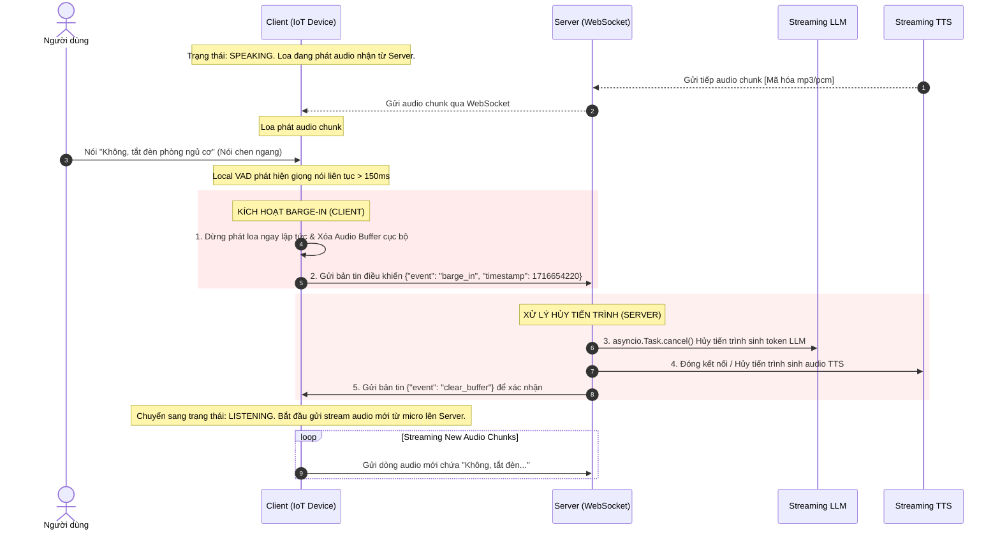

# GIẢI THUẬT NGẮT LỜI (BARGE-IN LOGIC)
## (Real-time Audio Interruption Design)

Tính năng ngắt lời (Barge-in) cho phép người dùng có thể nói chen ngang khi chatbot đang phát âm thanh phản hồi. Đây là yếu tố cốt lõi giúp cuộc hội thoại trở nên tự nhiên và mượt mà.

---

## 1. Nguyên Lý Hoạt Động (Principle of Operation)

Tính năng Barge-in hoạt động theo cơ chế **Phát hiện tại Edge (Client-side Detection)** và **Hủy tiến trình tại Cloud (Server-side Cancellation)**:

1.  **Phía Client (Edge):** Micro vẫn thu âm liên tục trong lúc Loa đang phát nhạc/âm thanh phản hồi. Một bộ phát hiện giọng nói (VAD) siêu nhẹ chạy cục bộ để kiểm tra xem có tiếng nói con người thu được qua micro hay không.
2.  **Phía Server (Cloud):** Khi nhận tín hiệu báo ngắt từ Client, lập tức hủy tất cả các luồng suy luận của LLM và kết nối TTS đang chạy để trả hệ thống về trạng thái lắng nghe.

---

## 2. Quy Trình Xử Lý Chi Tiết (Sequence Diagram)

Sơ đồ dưới đây mô tả chi tiết cách các tiến trình phát âm thanh bị ngắt và làm sạch bộ đệm (buffer) mạng khi người dùng bắt đầu nói chen ngang:



---

## 3. Lập Trình Bất Đồng Bộ Hủy Task Trên Server (Python Asyncio)

Trên FastAPI Server, để hủy tiến trình LLM và TTS đang chạy song song, Orchestrator sẽ lưu trữ tham chiếu đến đối tượng `asyncio.Task` của phiên làm việc.

Dưới đây là đoạn code Python minh họa cách quản lý việc hủy tác vụ khi xảy ra sự kiện ngắt lời:

```python
import asyncio
from fastapi import WebSocket

class ConnectionManager:
    def __init__(self):
        # Lưu các task đang chạy theo session_id
        self.active_tasks = {}

    def register_task(self, session_id: str, task: asyncio.Task):
        self.active_tasks[session_id] = task

    async def cancel_active_task(self, session_id: str):
        task = self.active_tasks.get(session_id)
        if task and not task.done():
            task.cancel()
            try:
                await task
            except asyncio.CancelledError:
                print(f"Task cho session {session_id} đã được hủy thành công.")
        if session_id in self.active_tasks:
            del self.active_tasks[session_id]

# Minh họa hàm nhận message từ WebSocket
async def websocket_endpoint(websocket: WebSocket, session_id: str, manager: ConnectionManager):
    await websocket.accept()
    try:
        while True:
            data = await websocket.receive_json()
            if data.get("event") == "barge_in":
                # Nhận sự kiện ngắt lời từ Client
                print(f"Nhận tín hiệu ngắt lời từ client cho session {session_id}")
                # Hủy Task sinh LLM + TTS hiện tại
                await manager.cancel_active_task(session_id)
                # Gửi lệnh xóa buffer về lại Client
                await websocket.send_json({"event": "clear_buffer"})
            
            # Xử lý các event audio khác...
    except Exception as e:
        print(f"Connection error: {e}")
```

---

## 4. Tối Ưu Hóa Phía Client Để Tránh Kích Hoạt Lầm (Acoustic Echo Cancellation - AEC)

Khi Loa đang phát và Micro đang thu, âm thanh từ Loa có thể dội lại Micro dẫn đến VAD nhận diện nhầm tiếng Loa phát ra là tiếng nói người dùng chen ngang, gây ra hiện tượng tự ngắt lời (Self-interruption).

Các biện pháp tối ưu hóa bắt buộc ở phía Client:
1.  **Acoustic Echo Cancellation (Khử tiếng vọng):** Sử dụng các mô-đun khử echo phần cứng hoặc phần mềm như `SpeexDSP` hay `PulseAudio AEC` để trừ đi phần tín hiệu âm thanh Loa đang phát ra khỏi tín hiệu Micro thu vào trước khi nạp dữ liệu vào VAD.
2.  **Ngưỡng năng lượng động (Dynamic Thresholding):** VAD sẽ tự động tăng ngưỡng nhận diện nhạy lên cao hơn khi loa đang hoạt động để tránh kích hoạt nhầm bởi tiếng ồn loa dội lại.
3.  **Xác minh thời gian (Temporal Verification):** Chỉ kích hoạt sự kiện ngắt lời khi VAD phát hiện giọng nói liên tục trong một khoảng thời gian tối thiểu (ví dụ: từ 150ms đến 250ms), tránh ngắt lời do các tiếng ồn xung đột đột ngột (tiếng vỗ tay, tiếng đóng cửa).
