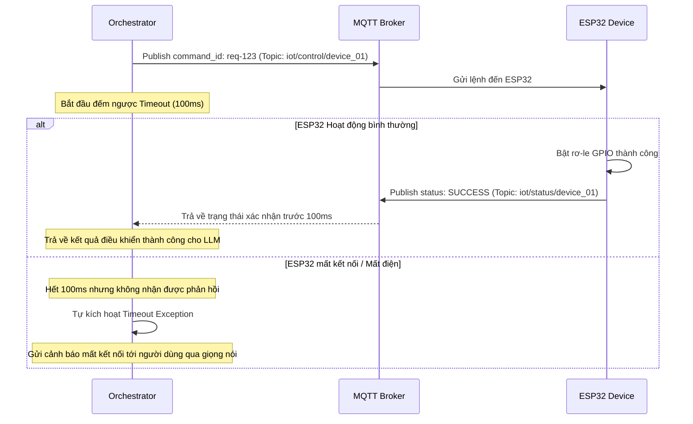

# LỚP ĐIỀU KHIỂN THIẾT BỊ IOT (IOT CONTROL LAYER)
## (IoT Communication & Payload Specification)

Tài liệu này đặc tả cơ chế giao tiếp giữa Server (Bộ điều phối trung tâm) và các thiết bị phần cứng (ESP32/ESP8266) thông qua giao thức MQTT.

---

## 1. Nguyên Lý Giao Tiếp MQTT

Giao thức **MQTT** hoạt động theo cơ chế Publish/Subscribe thông qua một Broker trung gian. Điều này giúp giảm thiểu sự phụ thuộc trực tiếp (tight coupling) giữa Server và phần cứng, tăng khả năng chịu lỗi và giảm băng thông truyền tin.


---

## 2. Định Dạng Bản Tin (Payload Specification)

Toàn bộ bản tin truyền qua MQTT sử dụng định dạng JSON để dễ dàng phân tích và xử lý trong cả Python và C++/MicroPython.

### 2.1. Bản tin điều khiển (Server $\rightarrow$ Device)
*   **Topic:** `iot/control/{device_id}` (Trong đó `{device_id}` là chuỗi định danh duy nhất của thiết bị phần cứng).
*   **Payload (JSON):**
    ```json
    {
        "command_id": "req-987654",
        "action": "WRITE",
        "parameters": {
            "power": "ON",
            "brightness": 80,
            "color_temp": 4000
        },
        "sent_at": 1716654215
    }
    ```

### 2.2. Bản tin phản hồi trạng thái (Device $\rightarrow$ Server)
Sau khi thực thi lệnh thành công hoặc thất bại, thiết bị phần cứng bắt buộc phải gửi phản hồi xác nhận (Acknowledge) về Server để đồng bộ hóa trạng thái phiên hội thoại.
*   **Topic:** `iot/status/{device_id}`
*   **Payload (JSON):**
    ```json
    {
        "command_id": "req-987654",
        "status": "SUCCESS",
        "current_state": {
            "power": "ON",
            "brightness": 80,
            "color_temp": 4000
        },
        "error_message": "",
        "latency_ms": 45
    }
    ```

---

## 3. Luồng Đồng Bộ & Xử Lý Lỗi Quá Giờ (Timeout Handling)

Để tránh việc Server bị treo khi thiết bị phần cứng bị mất nguồn hoặc mất kết nối Wi-Fi, Server cần có cơ chế quản lý Timeout bất đồng bộ.



---

## 4. Code Mẫu Gửi Lệnh MQTT Bất Đồng Bộ Trên Server (Python)

Đoạn code Python minh họa cách Server gửi lệnh điều khiển MQTT và đợi phản hồi bất đồng bộ (sử dụng `asyncio.Future` để chuyển đổi mô hình publish/subscribe bất đồng bộ của MQTT thành một hàm `awaitable` tiện lợi):

```python
import asyncio
import json
import uuid
import time
import paho.mqtt.client as mqtt

class AsyncMQTTManager:
    def __init__(self, broker_host="localhost", broker_port=1883):
        self.client = mqtt.Client()
        self.broker_host = broker_host
        self.broker_port = broker_port
        self.pending_requests = {}  # Lưu trữ các Future đợi kết quả theo command_id

    def connect(self):
        self.client.on_message = self._on_message
        self.client.connect(self.broker_host, self.broker_port)
        self.client.loop_start()

    def _on_message(self, client, userdata, message):
        try:
            payload = json.loads(message.payload.decode())
            cmd_id = payload.get("command_id")
            if cmd_id in self.pending_requests:
                # Set kết quả vào Future để đánh thức hàm đang await
                loop = self.pending_requests[cmd_id]["loop"]
                loop.call_soon_threadsafe(self.pending_requests[cmd_id]["future"].set_result, payload)
        except Exception as e:
            print(f"Lỗi xử lý phản hồi MQTT: {e}")

    async def send_command(self, device_id: str, parameters: dict, timeout=0.1) -> dict:
        cmd_id = str(uuid.uuid4())
        payload = {
            "command_id": cmd_id,
            "action": "WRITE",
            "parameters": parameters,
            "sent_at": int(time.time())
        }
        
        loop = asyncio.get_running_loop()
        future = loop.create_future()
        self.pending_requests[cmd_id] = {"future": future, "loop": loop}
        
        # Subscribe chủ đề trạng thái của thiết bị
        status_topic = f"iot/status/{device_id}"
        self.client.subscribe(status_topic)
        
        # Gửi lệnh
        control_topic = f"iot/control/{device_id}"
        self.client.publish(control_topic, json.dumps(payload))
        
        try:
            # Đợi kết quả phản hồi với thời gian timeout chỉ định
            result = await asyncio.wait_for(future, timeout=timeout)
            return result
        except asyncio.TimeoutError:
            print(f"Lỗi: Lệnh {cmd_id} gửi tới thiết bị {device_id} bị timeout.")
            return {"status": "TIMEOUT", "error_message": "Thiết bị không phản hồi."}
        finally:
            # Dọn dẹp request
            if cmd_id in self.pending_requests:
                del self.pending_requests[cmd_id]
```
