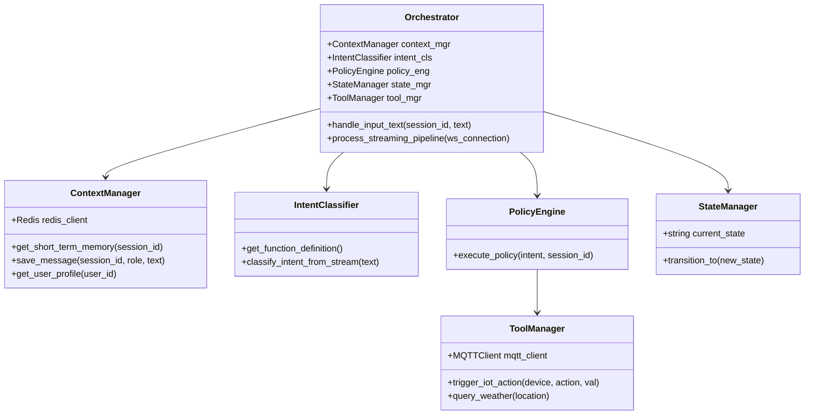

# THIẾT KẾ BỘ ĐIỀU PHỐI TRUNG TÂM (ORCHESTRATOR)
## (Central Orchestrator Module Design)

Tài liệu này chi tiết cấu trúc phần mềm của bộ điều phối trung tâm (Orchestrator), là nơi tích hợp các dịch vụ AI và ra quyết định hành động trong hệ thống Server.

---

## 1. Các Thành Phần Module

Bộ điều phối được xây dựng theo mô hình module hóa cao bằng ngôn ngữ Python, sử dụng các thư viện lập trình bất đồng bộ (`asyncio`) để đảm bảo không chặn tiến trình (non-blocking) khi xử lý đồng thời nhiều kết nối.



---

## 2. Chi Tiết Các Module

### 2.1. Quản lý Ngữ Cảnh (Context Manager)
Chịu trách nhiệm lưu trữ lịch sử hội thoại để cung cấp ngữ cảnh đầy đủ cho LLM.
*   **Bộ nhớ ngắn hạn (Short-term):** Lưu trên Redis dưới dạng danh sách các bản tin JSON. Key được lưu theo format `session:{session_id}:history`. Lịch sử được giới hạn (sliding window) tối đa 10 lượt hội thoại gần nhất.
*   **Bộ nhớ dài hạn (Long-term):** Dành cho lưu trữ thông tin cố định như tên thiết bị của người dùng, tùy chọn giọng đọc hoặc thông tin cá nhân.
*   **Ví dụ định dạng bộ nhớ ngắn hạn:**
    ```json
    [
        {"role": "user", "content": "Bật đèn phòng khách"},
        {"role": "assistant", "content": "Tôi đã bật đèn phòng khách cho bạn."}
    ]
    ```

### 2.2. Nhận Diện Ý Định (Intent Classifier / NLU)
*   Orchestrator sử dụng cơ chế **Function Calling (Gọi hàm)** của Gemini API hoặc OpenAI API làm bộ phân loại ý định chính xác cao.
*   Khi có Full Transcript từ STT, Orchestrator sẽ gửi danh sách định nghĩa hàm điều khiển (Schema) kèm câu lệnh người dùng đến LLM.
*   Nếu LLM trả lời là một lệnh gọi hàm (Function Call), Orchestrator sẽ chuyển tiếp thông tin này cho Policy Engine để gọi API điều khiển. Nếu LLM trả về văn bản bình thường, Orchestrator sẽ bỏ qua bước gọi hàm và chuyển thẳng sang luồng sinh giọng nói.

### 2.3. Quyết Định Hành Động (Policy Engine & Tool Manager)
*   **Policy Engine** là nơi định nghĩa các quy tắc nghiệp vụ (Business Rules). 
*   *Quy tắc điều khiển IoT:* Khi nhận được ý định điều khiển thiết bị thông minh, Policy Engine sẽ gọi `ToolManager.trigger_iot_action()`. 
*   *Xử lý lỗi ngoại lệ:* Nếu thiết bị không phản hồi trong vòng 100ms, Policy Engine tự động sinh mã lỗi chặn (Intercept) luồng xử lý và chèn thông báo lỗi vào Prompt của LLM để hướng dẫn LLM giải thích lỗi cho người dùng.

### 2.4. Quản Lý Trạng Thái (StateManager State Machine)
Đảm bảo hệ thống hoạt động ổn định và kiểm soát luồng xử lý qua mô hình máy trạng thái (State Machine):

| Trạng thái | Điều kiện kích hoạt | Hành động tương ứng |
|---|---|---|
| **`IDLE`** | Kết nối WebSocket mới được thiết lập. | Đợi tín hiệu Wake Word từ Client. |
| **`LISTENING`** | Nhận gói tin Wake Word thành công. | Tiếp nhận dòng dữ liệu âm thanh từ Micro và chuyển tiếp đến STT. |
| **`PROCESSING`** | Nhận diện dứt câu nói (VAD phát hiện khoảng lặng). | Dừng nhận audio tạm thời, phân tích ý định, gọi thiết bị IoT, gửi prompt cho LLM. |
| **`SPEAKING`** | Token đầu tiên của LLM bắt đầu sinh và chuyển đổi TTS. | Đẩy dòng dữ liệu âm thanh (TTS chunks) xuống Client để phát qua loa. Lắng nghe tín hiệu ngắt lời. |
| **`ERROR`** | Xảy ra lỗi kết nối API hoặc lỗi phần cứng. | Phát ra âm thanh cảnh báo lỗi cục bộ, ghi nhận log lỗi hệ thống. |
