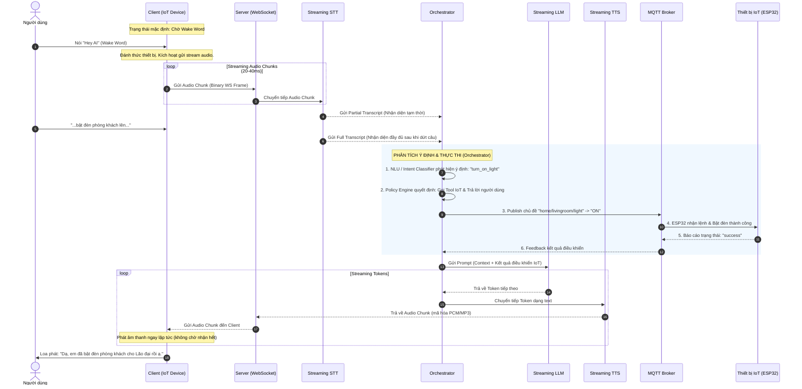

# LUỒNG XỬ LÝ DỮ LIỆU TỔNG THỂ (PIPELINE FLOW)
## (System Data Flow & Diagrams)

Tài liệu này trình bày sơ đồ khối hệ thống và sơ đồ tuần tự (Sequence Diagram) để mô tả cách dòng dữ liệu âm thanh và các tín hiệu điều khiển chạy qua hệ thống Voice Chatbot IoT thời gian thực.

---

## 1. Sơ Đồ Khối Hệ Thống (System Architecture Diagram)

Hệ thống hoạt động theo mô hình Client-Server song công (Full-Duplex) thông qua kết nối WebSocket ổn định:

```mermaid
graph TD
    %% Nodes
    subgraph Client ["THIẾT BỊ CLIENT (IoT Device / Raspberry Pi)"]
        Mic["🎤 Microphone (16kHz, 16bit)"] --> VAD["🔊 Local VAD & Wake Word"]
        VAD -->|Trạng thái Wake/Active| WSClient["🌐 WebSocket Client"]
        WSClient -->|Phát âm thanh| Speaker["🔈 Loa / Audio Out"]
    end

    subgraph Server ["MÁY CHỦ BỘ ĐIỀU PHỐI (FastAPI Server)"]
        WSServer["🌐 WebSocket Server"]
        STT["🎙️ Streaming STT (Deepgram/Whisper)"]
        Orchestrator["🧠 Orchestrator (Bộ điều phối trung tâm)"]
        LLM["🤖 Streaming LLM (Gemini/GPT-4o)"]
        TTS["🗣️ Streaming TTS (Edge-TTS/ElevenLabs)"]
    end

    subgraph IoT_Cloud ["LỚP THIẾT BỊ VẬT LÝ (IoT Control Layer)"]
        MQTT_Broker["🔌 MQTT Broker (Mosquitto)"]
        ESP32["📟 ESP32 Microcontrollers"]
        Devices["💡 Thiết bị (Đèn, Điều hòa, Khóa...)"]
    end

    %% Connections
    WSClient <-->|Stream Audio & Control Messages (Barge-in)| WSServer
    WSServer <--> STT
    STT -->|Partial/Full Transcript| Orchestrator
    Orchestrator <--> LLM
    Orchestrator <--> TTS
    TTS --> WSServer
    
    Orchestrator -->|Publish Lệnh điều khiển| MQTT_Broker
    MQTT_Broker -->|Giao tiếp MQTT| ESP32
    ESP32 --> Devices
    ESP32 -->|Phản hồi trạng thái| MQTT_Broker
    MQTT_Broker -->|Feedback trạng thái| Orchestrator
```

---

## 2. Luồng Xử Lý Tuần Tự (Sequence Diagram)

Sơ đồ dưới đây mô tả chu trình hoàn chỉnh từ lúc người dùng nói câu lệnh điều khiển thiết bị thông minh đến lúc nhận được xác nhận bằng giọng nói của Chatbot:



---

## 3. Các Giai Đoạn Luồng Dữ Liệu

### 3.1. Đánh Thức & Phát Hiện Giọng Nói (Wake Word & VAD)
*   **Trạng thái tĩnh (Idle State):** Client chạy bộ thu âm ngầm nhưng không truyền tải dữ liệu qua mạng. Luồng âm thanh chỉ được nạp cục bộ vào thư viện `Porcupine` để nhận dạng Wake Word.
*   **Kích hoạt (Wake State):** Khi phát hiện Wake Word, Client chuyển sang trạng thái hoạt động (Active). Bắt đầu ghi âm và đẩy liên tiếp các chunk âm thanh (20-40ms) lên Server. WebRTCVAD chạy đồng hành để theo dõi tín hiệu giọng nói của người dùng và xác định điểm kết thúc câu nói (khoảng lặng > 500ms).

### 3.2. Chuyển Đổi Dữ Liệu Thời Gian Thực (Streaming & AI)
*   **Đầu vào Server:** Server nhận dòng nhị phân PCM từ Client và chuyển tiếp dạng luồng (giao thức WebSocket/gRPC) đến Deepgram API để thực hiện chuyển văn bản (STT).
*   **Xử lý văn bản từng phần (Partial processing):** Deepgram gửi về các kết quả tạm thời. Orchestrator phân tích để phát hiện các tín hiệu ngắt lời hoặc chuẩn bị sẵn cấu trúc câu lệnh.

### 3.3. Bộ Điều Phối & Sinh Phản Hồi (Orchestration & Output)
*   **Ra quyết định (Policy Execution):** Ngay khi nhận được Full Transcript, Orchestrator phân loại và xử lý logic (gọi API phần cứng qua MQTT).
*   **Sinh phản hồi đa chặng (Streaming LLM -> TTS):** Thay vì chờ LLM sinh hết câu, mỗi token LLM được sinh ra lập tức được chuyển thẳng vào engine TTS để chuyển đổi thành âm thanh. Client bắt đầu nhận âm thanh và phát ra loa khi câu trả lời từ LLM vẫn đang tiếp tục được sinh ra.
