# CẤU HÌNH STREAMING & CHỈ SỐ KPIS
## (Streaming Configurations & KPIs)

Tài liệu này đặc tả chi tiết các thông số truyền dẫn dữ liệu thời gian thực và các chỉ số đo lường hiệu suất (KPIs) bắt buộc của hệ thống Voice Chatbot IoT.

---

## 1. Thông Số & Cấu Hình Streaming (Streaming Configurations)

Để đạt được trải nghiệm hội thoại liên tục giống như nói chuyện giữa người với người, toàn bộ dữ liệu âm thanh và văn bản phải được chia nhỏ và truyền đi dưới dạng dòng dữ liệu (Streaming Pipeline).

| Tham số | Giá trị | Đơn vị | Mô tả |
|---|---|---|---|
| **Audio Sample Rate** | 16000 | Hz | Tần số lấy mẫu âm thanh đầu vào, tiêu chuẩn cho STT. |
| **Audio Bit Depth** | 16 | bit | Độ sâu bit tín hiệu (PCM Signed 16-bit Little Endian). |
| **Audio Channels** | 1 (Mono) | - | Kênh đơn nhằm giảm băng thông truyền mạng. |
| **Audio Chunk Size** | 20 - 40 | ms | Khoảng thời gian thu âm cho mỗi gói tin nhị phân gửi đi. Tương đương 640 - 1280 bytes dữ liệu thô (PCM). |
| **VAD Frame Length** | 10, 20 hoặc 30 | ms | Độ dài frame dùng cho thư viện WebRTCVAD để nhận dạng giọng nói cục bộ. |
| **STT Partial Interval** | 200 - 500 | ms | Thời gian cập nhật kết quả nhận dạng tạm thời gửi về Orchestrator. |
| **LLM Token Speed** | 50 - 150 | ms/token | Tốc độ sinh token trung bình của LLM để đảm bảo không bị ngắt quãng luồng đọc. |
| **TTS Audio Chunk Size** | 40 - 120 | ms | Độ dài đoạn âm thanh do TTS tổng hợp gửi về Client phát ngay. |

---

## 2. Chỉ Số Đánh Giá Chất Lượng (KPIs)

Hiệu suất của hệ thống được đánh giá qua các chỉ số kỹ thuật chính (Key Performance Indicators) sau:

```mermaid
gantt
    title Phân Rã Độ Trễ Mục Tiêu (End-to-End Latency < 500ms)
    dateFormat  X
    axisFormat %s
    section Client
    Thu âm & VAD cục bộ      :active, 0, 30
    Truyền dẫn mạng (WS)     : 30, 80
    section Server / AI
    Dịch vụ STT (Deepgram)   : 80, 220
    Xử lý Orchestrator & LLM : 220, 370
    Tổng hợp TTS (Edge-TTS)  : 370, 460
    section Client Out
    Mạng về & Loa phát       : 460, 490
```

*   **Độ trễ đầu cuối (E2E Latency):** $< 500\text{ ms}$ (Mục tiêu tối ưu: $350 - 450\text{ ms}$).
    *   *Định nghĩa:* Tính từ thời điểm người dùng kết thúc câu nói (phát hiện bởi VAD) đến khi âm thanh phản hồi đầu tiên phát ra từ loa.
*   **Độ chính xác STT (Word Error Rate - WER):** $< 10\%$
    *   *Định nghĩa:* Tỷ lệ lỗi chữ (thay thế, chèn, xóa) trên tổng số chữ thực tế được nói trong môi trường thông thường.
*   **Tỷ lệ hiểu đúng ý định (Intent Accuracy):** $> 90\%$
    *   *Định nghĩa:* Tỷ lệ phân loại chính xác ý định (Intent) và trích xuất thực thể (Entities) của câu lệnh điều khiển IoT.
*   **Tỷ lệ thành công IoT (IoT Success Rate):** $> 95\%$
    *   *Định nghĩa:* Tỷ lệ lệnh IoT gửi đi được thiết bị nhận, thực thi thành công và gửi phản hồi xác nhận về Server trong vòng dưới 100ms từ khi gửi lệnh.
*   **Tỷ lệ ngắt lời thành công (Barge-in Success Rate):** $> 95\%$
    *   *Định nghĩa:* Tỷ lệ loa dừng phát ngay lập tức ($< 200\text{ ms}$) khi người dùng bắt đầu nói chen ngang trong lúc máy đang phát âm thanh phản hồi.

---

## 3. Quy Trình & Điểm Đo Lường Độ Trễ (Latency Instrumentation)

Để giám sát và tối ưu hóa độ trễ thời gian thực, Server sẽ ghi nhận các nhãn thời gian (timestamp) theo mili-giây tại các mốc xử lý sau:

1.  $T_0$: Thời điểm Client kết thúc nói (VAD phát hiện khoảng lặng kéo dài quá 500ms).
2.  $T_1$: Thời điểm Server nhận gói audio cuối cùng của câu nói.
3.  $T_2$: Thời điểm Server nhận đầy đủ transcript (Full Transcript) từ STT API.
4.  $T_3$: Thời điểm Server nhận token văn bản đầu tiên trả về từ LLM API.
5.  $T_4$: Thời điểm Server nhận chunk âm thanh đầu tiên từ TTS API.
6.  $T_5$: Thời điểm Client nhận được chunk âm thanh đầu tiên và bắt đầu phát ra loa.

**Các khoảng trễ thành phần:**
*   $\text{Trễ STT} = T_2 - T_0$
*   $\text{Trễ LLM (First Token)} = T_3 - T_2$
*   $\text{Trễ TTS (First Audio)} = T_4 - T_3$
*   $\text{Trễ Mạng + Loa} = T_5 - T_4$
*   $\text{Tổng độ trễ E2E} = T_5 - T_0$
